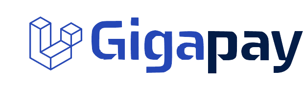

<div align="center">
    <p></p>
    <p>
    
    
    
</p>
</div>

# Laravel-Gigapay
A simple API wrapper for [Gigapay's](https://gigapay.co) APIs. It gives you helper methods that will make your work with `gigapay's` API easy, fast and efficient


**Laravel-Gigapay** manage resources like `Employees`, `Invoices`, `Payouts`, `Pricing` and `Webhooks`.

It uses the APIs provided by `Gigapay`, here is it's [API documentation](https://developer.gigapay.se)

You can also look into the [postman collection](https://documenter.getpostman.com/view/13692349/UyxkkR3T) to call the API by yourself to better understand it.

To understand the Event flow of `Gigapay`, you can see it's [Event Documentation](https://developer.gigapay.se/#events)

# Table of contents
- [Installation](#installation)
- [Configuration](#configuration)  
- [Employee](#employee)
  * [List](#employee-list)
  * [Creation](#employee-creation)
  * [Retrieve single](#employee-retrieve)
  * [Update](#employee-update)
  * [Delete](#employee-delete)
  * [Resend Invite](#employee-resend)
  * [Helpers](#employee-helper)
- [Payout](#payout)
  * [List](#payout-list)
  * [Creation](#payout-creation)
  * [Multiple Creation](#payout-multiple-creation)
  * [Retrieve single](#payout-retrieve)
  * [Delete](#payout-delete)
  * [Resend](#payout-resend)
  * [Helpers](#payout-helper)
- [Invoice](#invoice)
  * [List](#invoice-list)
  * [Retrieve single](#invoice-retrieve)
  * [Update](#invoice-update)
  * [Delete](#invoice-delete)
- [Pricing](#pricing)
  * [List](#pricing-list)
  * [Retrieve single](#pricing-retrieve)
  * [Calculate Pricing](#pricing-calculate)
  * [Calculate Bulk](#pricing-calculate-bulk)
- [Webhook](#webhook)
  * [Set-up](#webhook-setup)
  * [List](#webhook-list)
  * [Creation](#webhook-creation)
  * [Retrieve single](#webhook-retrieve)
  * [Update](#webhook-update)
  * [Delete](#webhook-delete)
- [ListResource](#listresource)  
  * [Pagination](#paginate)
  * [Search](#search)
  * [Expand Resources](#expand)
  * [Add Filter](#addFilter)
  * [Get JSON data](#getJson)
- [Exception Handling](#exception-handling)
  * [Gigapay Exception](#gigapay-exception)


# Installation
Install the package via composer:

`composer require mazimez/laravel-gigapay`

Publish the config file:

`php artisan vendor:publish --provider="Mazimez\Gigapay\GigapayServiceProvider"`

# Configuration

The published config file `config/gigapay.php` looks like:

```php
<?php

use Mazimez\Gigapay\Events\EmployeeClaimed;
use Mazimez\Gigapay\Events\EmployeeCreated;
use Mazimez\Gigapay\Events\EmployeeNotified;
use Mazimez\Gigapay\Events\EmployeeVerified;
use Mazimez\Gigapay\Events\InvoiceCreated;
use Mazimez\Gigapay\Events\InvoicePaid;
use Mazimez\Gigapay\Events\PayoutAccepted;
use Mazimez\Gigapay\Events\PayoutCreated;
use Mazimez\Gigapay\Events\PayoutNotified;

return [

    /*
    |--------------------------------------------------------------------------
    | Gigapay Server URL
    |--------------------------------------------------------------------------
    |
    | Gigapay generally has 2 servers, 1 for demo and 1 for production
    | both server has different url, by default it will use the demo server URL
    | but you can change it from your project's .env file.
    | also currently Gigapay's APIs are at version 2, so it will use version 2
    |
    */

    'server_url' => env('GIGAPAY_SERVER_URL', 'https://api.demo.gigapay.se/v2'),

    /*
    |--------------------------------------------------------------------------
    | Gigapay Token
    |--------------------------------------------------------------------------
    |
    | Gigapay uses this token to identify and authenticate requests,
    | you can get this Token from your Gigapay account
    | Note that Tokens are different for demo server and production server
    | define it in your .env.
    |
    */

    'token' => env('GIGAPAY_TOKEN'),

    /*
    |--------------------------------------------------------------------------
    | Gigapay integration id
    |--------------------------------------------------------------------------
    |
    | Integrations are like Transactions, it's a parent object of all other objects in the Gigapay API
    | whenever you do any action in Gigapay, it will be in integration and it has a integration id
    | Gigapay's API need integration id, you can create integration with Gigapay APIs from https://developer.gigapay.se/#create-an-integration
    |
    */

    'integration_id' => env('GIGAPAY_INTEGRATION_ID'),

    /*
    |--------------------------------------------------------------------------
    | Gigapay lang
    |--------------------------------------------------------------------------
    |
    | Language for the API responses. default will be english(en)
    |
    */

    'lang' => env('GIGAPAY_LANG', 'en'),


    /*
    |--------------------------------------------------------------------------
    | Gigapay events mapping
    |--------------------------------------------------------------------------
    |
    | mapping of Gigapay's different webhook events to route that will receive the webhook event
    |
    */

    'events_mapping' => [
        'Employee.created' => 'employee-created',
        'Employee.notified' => 'employee-notified',
        'Employee.claimed' => 'employee-claimed',
        'Employee.verified' => 'employee-verified',
        'Payout.created' => 'payout-created',
        'Payout.notified' => 'payout-notified',
        'Payout.accepted' => 'payout-accepted',
        'Invoice.created' => 'invoice-created',
        'Invoice.paid' => 'invoice-paid',
    ],

    /*
    |--------------------------------------------------------------------------
    | Gigapay Events
    |--------------------------------------------------------------------------
    |
    | List of Gigapay events that you can listen to by Listeners.
    |
    */

    'events_list' => [
        EmployeeClaimed::class,
        EmployeeCreated::class,
        EmployeeNotified::class,
        EmployeeVerified::class,
        InvoiceCreated::class,
        InvoicePaid::class,
        PayoutAccepted::class,
        PayoutCreated::class,
        PayoutNotified::class,
    ]
];
```
once the config file is ready, you need to add some variables into your `.env` file. there are 4 variables
- GIGAPAY_TOKEN = You will get this token from your `gigapay` account
- GIGAPAY_INTEGRATION_ID = You can get this id from your `gigapay` account or from [`Gigapay's` API](https://developer.gigapay.se/#integrations)
- GIGAPAY_SERVER_URL = `gigapay` has 2 servers, demo and production. both's server's URL can be found on [Gigapay's documentation](https://developer.gigapay.se/#authentication)
- GIGAPAY_LANG = the language in which `Gigapay` will give it's responses or errors

keep in mind that `Gigapay` has separate token and integration id for each server, so whenever you switch server, remember to update SERVER URL with tokens and integration id too.
```dosini
GIGAPAY_TOKEN="your-gigapay-account-token"
GIGAPAY_INTEGRATION_ID="yours-gigapay-account-integration-id"
GIGAPAY_SERVER_URL="https://api.demo.gigapay.se/v2"
GIGAPAY_LANG="en"
```
# Employee
An Employee is an individual performing tasks within your organization, employed or sub-contracted by `Gigapay`. To add an Employee to your organization you can create an Employee object. The Employee will be notified and `Gigapay` will verify their identity and working permits.
you can learn more about that from [`Gigapay` doc](https://developer.gigapay.se/#employees)

### employee-creation
- To create an Employee, you need it's `name` and either `email` or `cellphone_number` other data are not mandatory.
- you can create Employee with `create` method by passing all the data as arguments and you can also use `createByArray` method which takes and array with the same data, in that you only need to add the data that's required.
- the metadata is a `Json` object so remember to use `json_encode()` method. 
- you can get more info about employee's object from [`Gigapay` doc](https://developer.gigapay.se/#the-employee-object)

```php
use Mazimez\Gigapay\Employee;

//#1 creating Employee by passing all data in arguments
$employee = Employee::create(
            'jhone doe',  //employee's name (required)
            'test@gmail.com',  //employee's email (has to be unique)
            null,  //employee's phone number(proper swidish phone number, has to be unique)
            'SWE', //employee's country
            json_encode([
                "data" => "data from your system"  //any metadata that you want to add from you system(json encoded)
            ]),
            '1-2-3' //employee's ID(has to be unique)
        );
return $employee->getJson();

//#2 creating Employee by passing all data in an array
$employee = Employee::createByArray([
    "id"=>"1-2-3", //employee's ID(has to be unique)
    "name"=>"jhone doe", //employee's name (required)
    "email"=>"test@gmail.com", //employee's email (has to be unique)
    "metadata"=>json_encode([
        "data" => "data from your system" //any metadata that you want to add from you system(json encoded)
    ]),
    "cellphone_number"=>"123456789", //employee's phone number(proper swidish phone number, has to be unique)
    "country"=>"SWE", //employee's country
]);
return $employee->getJson();
```
the `getJson()` method will return the Employee's object in JSON format

### employee-update
- Employee resource can be updated any time, the data that can be updated are `id`, `name`, `email`, `country`, `cellphone_number`, `metadata`. 
- each data can be updated by calling separate method and also by updating the values on employee object and then calling save() method to update the whole employee object. 
- remember to use `json_encode()` before saving the metadata
- also, to update the ID of employee, please use the septate method `updateId()` instead of `save()`, since `save()` will try to update the employee with current id(new id that doesn't exists in `Gigapay's` Database)
- the rules about uniqueness and format still applies here. you can get for info from [`Gigapay` doc](https://developer.gigapay.se/#update-an-employee)

```php
use Mazimez\Gigapay\Employee;

//#1: updating values using separate methods
$employee = Employee::findById('123'); //finding employee by id

$employee = $employee->updateCountry('SWE'); //updating country
$employee = $employee->updateName("test employee"); //updating name
$employee = $employee->updateEmail("jhone@doe.com"); //updating email
$employee = $employee->updateMetaDate(json_encode([
    "data" => "some more data from you system",  //updating metadata
]));
$employee = $employee->updateId('12354'); //updating id
return $employee->getJson();

//#2 updating values using save() methods
$employee = Employee::findById('dvsdvsdv'); //finding employee by id

$employee->country  = "SWE"; //updating country
$employee->name = "test employee"; //updating name
$employee->email = "jhone@32323doe.com"; //updating email
$employee->metadata = json_encode([
    "data" => "some more data from you system", //updating metadata
]);
$employee->save(); //saving the employee object
return $employee->getJson();
```
### employee-list
The Employee::list() method will return the [ListResource](#listresource) for employees that you can use to apply filters and search into all your employees. you can get more info from [Gigapay doc](https://developer.gigapay.se/#list-all-employees)
```php
use Mazimez\Gigapay\Employee;

$employees = Employee::list(); //getting list of employee
$employees = $employees->paginate(1, 5);  //add pagination
return $employees->getJson();
```

### employee-retrieve
You can retrieve any employee by it's id. you can get more info from [Gigapay doc](https://developer.gigapay.se/#retrieve-an-employee)
```php
use Mazimez\Gigapay\Employee;

$employee = Employee::findById('1'); //getting employee by it's id
return $employee->getJson();
```

### employee-delete
You can delete any employee by calling the destroy method on Employee instance  but we can not delete an Employee after a `Payout` has been registered to it. get for info from [`Gigapay` doc](https://developer.gigapay.se/#delete-a-employee)
```php
use Mazimez\Gigapay\Employee;

$employee = Employee::findById('1'); //getting employee by it's id
$employee->destroy(); //deletes the employee
return $employees->getJson(); //return the empty Employee instance
```
### employee-resend
Employee will get 1 email to join, on the mail-id that we provided while creating the Employee, we can also resend that mail in case something gets wrong. After resending, you need to wait at least 24 hours before resending again. get for info from [`Gigapay` doc](https://developer.gigapay.se/#resend-an-invitation)
```php
use Mazimez\Gigapay\Employee;

$employee = Employee::findById('1'); //getting employee by it's id
$employee->resend(); //resend invite to the employee
```
### employee-helper
There are some helper methods that you can use on employee instance. for example:
  - `getAllPayouts()` that will return the [ListResource](#listresource) for `Payouts` on that Employee.
```php
use Mazimez\Gigapay\Employee;

$employee = Employee::findById('1'); //getting employee by it's id
$payouts = $employee->getAllPayouts(); //gettin payouts for that perticular employee
return $payouts->getJson(); //returning the payouts in json
```

# Payout
To make a `payout` to an Employee you need to create a `Payout` object. The Employee is notified of the `Payout` once the corresponding Invoice is paid. The Employee will need to sign and accept the `Payout` before it is disbursed to their account.
you can learn more about that from [`Gigapay` doc](https://developer.gigapay.se/#payouts)

### payout-creation
- To create an `Payout`, you either need it's `amount` or `invoiced_amount` or `cost `, anyone one of these data is required. 
- also you need to add `Employee id` and `description` for that `payout`. also employee needs to be verified before you start paying him/her salaries(`amount`). 
- just like [Employee](#employee) resource, Payout also have 2 methods for creation. `create` method takes data in Arguments while `createByArray` takes data as an Array.
- while providing metadata, remember to use `json_encode()` method.
- you can get more info about `Payout`'s pricing from [Gigapay doc](https://developer.gigapay.se/#pricing)

```php
use Mazimez\Gigapay\Payout;

//#1 creating payout with arguments
$payout = Payout::create(
            '9aa16b42-d0f3-420f-ba57-580c3c86c419', //employee id
            'Instagram samarbete 2021-11-13.', //description for payout
            120, //amount of payout
            null, //cost of payout
            null, //invoice amount of payout
            'SEK', //currency of payout
            json_encode([
                "data" => "data from your system" //metadata of payout
            ]),
            null, //The time at which the gig will start. Displayed as ISO 8601 string.
            null, //The time at which the gig will end. Displayed as ISO 8601 string.
            3 //Unique identifier for the object.
);
return $payout->getJson();

//#2 creating payout by array
$payout = Payout::createByArray([
            "employee" => "1-2-3", //employee id
            "invoiced_amount" => "120", //invoice amount of payout
            "description" => "test description", //description for payout
            "metadata" => json_encode([
                "data" => "data from your system" //metadata of payout
            ]),
            "currency"=>"SEK", //currency of payout
            "id"=>"payout-1-2-3" //Unique identifier for the object. 
        ]);
return $payout->getJson();
```
the `getJson()` method will return the `Payout`'s object in JSON format

### payout-multiple-creation
- `Gigapay` also provides API to create multiple payouts at once
- All of this payouts will be added to the same Invoice object.
- it takes an array(json) in the payout object structure.
- you need to at least provide `employee-id`, `description` and either one from `amount` , `cost` , `invoice_amount`. other things are not required.
- you can create payout to different employees all together.
- you can get more info from [Gigapay doc](https://developer.gigapay.se/#register-multiple-payouts)
```php
use Mazimez\Gigapay\Payout;

//creating 3 payouts to 3 different employees (with different specification)
$data = collect();
//any logic for calculating the payout value
$data->push([
    "employee" => "employee-id-1",
    "description" => "test description",
    "invoiced_amount" => "210",
]);
//any logic for calculating the payout value
$data->push([
    "employee" => "employee-id-2",
    "description" => "test description",
    "cost" => "210",
    "country" => "SWE",
    "metadata" => [
        "data" => "data about your system"
    ],
]);
//any logic for calculating the payout value
$data->push([
    "id" => "test-id",
    "employee" => "employee-id-3",
    "description" => "test description",
    "amount" => "210",
    "country" => "SWE",
    "currency" => "SEK"
]);
//creating multiple payouts by giving the array
$payouts = Payout::createMultiple($data->toArray()); 
return $payouts; //returns an array of Payout objects
```
### payout-list
The Payout::list() method will return the [ListResource](#listresource) for `payouts` that you can use to apply filters and search into all your `payout`. you can get more info from [`Gigapay` doc](https://developer.gigapay.se/#list-all-payouts)
```php
use Mazimez\Gigapay\Payout;

$payouts = Payout::list(); //getting list of employee
$payouts = $payouts->paginate(1, 5);  //add pagination
return $payouts->getJson();
```

### payout-retrieve
You can retrieve any `payout` by it's id. you can get more info from [`Gigapay` doc](https://developer.gigapay.se/#retrieve-a-payout)
```php
use Mazimez\Gigapay\Payout;

$payout = Payout::findById('1'); //getting payout by it's id
return $payout->getJson();
```

### payout-delete
You can delete any `payout` by calling the destroy method on `Payout` instance but we can not delete a `payout` belonging to a paid Invoice or an Invoice on credit. get more info from [Gigapay doc](https://developer.gigapay.se/#delete-a-payout)
```php
use Mazimez\Gigapay\Payout;

$payout = Payout::findById('1'); //getting payout by it's id
$payout->destroy(); //deletes the payout
return $payout->getJson(); //return the empty payout instance
```
### payout-resend
Once the `Payout` is been paid, Employee should get the mail about his/her `payout`. you can also resend the mail using the resend() method on `payout` instance. keep in mind that mail can only be sent once the `Payout` has been paid. get more info from [`Gigapay` doc](https://developer.gigapay.se/#resend-a-notification)
```php
use Mazimez\Gigapay\Payout;

$payout = Payout::findById('89f9cfbe-f1ec-4d17-a895-21cdb584eb4d'); //getting payout by it's id
$payout->resend(); //resend mail to the employee
```
### payout-helper
There are some helper methods that you can use on `payout` instance. for example:
  - `expandInvoice()` this method will expand the invoice field on `payout` and gives the whole invoice's JSON data.
  - `expandEmployee()` this method will expand the employee field on `payout` and gives the whole employee's JSON data.

you can also chain this method on same `Payout` instance
```php
use Mazimez\Gigapay\Payout;

$payout = Payout::findById('89f9cfbe-f1ec-4d17-a895-21cdb584eb4d'); //getting payout by it's id
$payout->expandInvoice()->expandEmployee();//expanding invoice and employee field
return $payout->getJson(); //returning the payouts in json(with expanded values)
```
# invoice
An Invoice groups `Payouts` together. It is a managed object, you can not create them directly. When a `Payout` is created it is added to the Invoice that is currently open. If there is no open Invoice, a new will be created.
you can learn more about that from [Gigapay doc](https://developer.gigapay.se/#invoices)


### invoice-list
The `Invoice::list()` method will return the [ListResource](#listresource) for invoices that you can use to apply filters and search into all your invoice. you can get more info from [`Gigapay` doc](https://developer.gigapay.se/#list-all-invoices)
```php
use Mazimez\Gigapay\Invoice;

$invoices = Invoice::list(); //getting list of invoices
$invoices = $invoices->paginate(1, 5);  //add pagination
return $invoices->getJson();
```

### invoice-retrieve
You can retrieve any invoice by it's id. you can get more info from [`Gigapay` doc](https://developer.gigapay.se/#retrieve-an-invoice)
```php
use Mazimez\Gigapay\Invoice;

$invoice = Invoice::findById('f3ee8cb8-fc95-4ea2-9b2e-18875b0d759a');//getting invoice by it's ID
return $invoice->getJson();
```
### invoice-update
- The only fields that can be updated in invoice resource are `id` and `metadata`. 
- just like Employee, they have the separate method for that and also a `save()` method that will update the whole instance with `Gigapay`
- To update the ID of invoice, please use the septate method `updateId()` instead of `save()`, since `save()` will try to update the invoice with current id(new id that doesn't exists in `Gigapay's` Database)
```php
use Mazimez\Gigapay\Invoice;

//#1: updating values using separate methods
$invoice = Invoice::findById('4bb6bd41-643e-43fe-af09-206c755088c9');
$invoice = $invoice->updateId("123");  //updating id
$invoice =$invoice->updateMetaDate(json_encode([
    "data" => "data from your system" //updating metadata
]));

//#2 updating values using save() methods
$invoice->metadata = json_encode([
    "data" => "data from your system" //updating metadata
]);
$invoice->save();
```

### invoice-delete
You can delete any invoice by calling the destroy method on invoice instance but we can not delete a paid Invoice or an Invoice on credit. get for info from [`Gigapay` doc](https://developer.gigapay.se/#delete-an-invoice)
```php
use Mazimez\Gigapay\Invoice;

$invoice = Invoice::findById('f3ee8cb8-fc95-4ea2-9b2e-18875b0d759a');//getting invoice by it's ID
$invoice->destroy(); //deletes the invoice
return $invoice->getJson(); //return the empty invoice instance
```
# Pricing
- The Pricing Resource allows you to calculate the price of payout you would like to make, and to retrieve the price information about previously made payouts. The Resource is designed to mirror the Payouts Resource as closely as possible, e.g. the same request can be used to retrieve the price information of a Payout you'd like to make and to actually make it.
- Either `amount`, `invoiced_amount` or `cost` is used as a basis for calculating the Pricing breakdown. 
- One is provided and the other are calculated based on that. Their definitions are:
 1. `amount`: net amount paid out plus obligations paid by the recipient.
 2. `invoiced_amount`: `amount` plus obligations paid by the employer.
 3. `cost`: `invoiced_amount` plus Gigapay's fee. This is the final amount you end up paying.
### Pricing-List
The `Pricing::list()` method will return the [ListResource](#listresource) for pricing that you can use to apply filters. you can get more info from [`Gigapay` doc](https://developer.gigapay.se/#list-pricing-info)
```php
use Mazimez\Gigapay\Pricing;

$pricing = Pricing::list(); //getting list of pricing
$pricing = $pricing->paginate(1, 5);  //add pagination
return $pricing->getJson();
```
### Pricing-Retrieve
You can retrieve any payout's Pricing info by payout's id. you can get more info from [`Gigapay` doc](https://developer.gigapay.se/#retrieve-pricing-info-of-payout)
```php
use Mazimez\Gigapay\Pricing;

$pricing = Pricing::findById('89f9cfbe-f1ec-4d17-a895-21cdb584eb4d')//getting pricing info by payout's ID
return $pricing->getJson();
```
### Pricing-Calculate
- Pricing resource mainly helps you calculating the payouts before actually making it. you can use `Pricing::calculatePricing` method to calculate any payout without actually making it.
- while calculating pricing, you need to give `employee_id` as well as the amount that you want to pay, you can give either the `amount` or `cost` or `invoiced_amount` according to your need.
```php
use Mazimez\Gigapay\Pricing;

$pricing = Pricing::calculatePricing(
        '0d42728d-b565-402d-80aa-a20bec94a9a2', //id of employee that you want to pay
        'SEK', //currency of payout
        null, //cost (only 1 out cost, amount and invoiced_amount is allowed)
        '120', //amount (only 1 out cost, amount and invoiced_amount is allowed)
        null, //invoiced_amount (only 1 out cost, amount and invoiced_amount is allowed)
        'test', //description
        false, //full_salary_specification
        json_encode([
            "data" => "data from your system" //metadata of payout
        ]), 
        null, //start_at
        null, //end_at
        null, //id
    );
return $pricing->getJson();
    
```

### pricing-calculate-bulk
- `Gigapay` also provides API to calculate the payout in bulk(multiple payouts at once)
- it takes an array(json) in the payout object structure.
- you need to at least provide `employee-id`, and either one from `amount` , `cost` , `invoice_amount`. other things are not required (`description` is also not required).
- the you can calculate pricing for different employees all together.
- you can get more info from [Gigapay doc](https://developer.gigapay.se/#calculate-bulk-pricing-info)
```php
use Mazimez\Gigapay\Pricing;

//calculating pricing info for 3 different payouts to 3 different employees (with different specifications)
$pricings =  Pricing::calculateBulk([
            [
                "employee" => "employee-id-1",
                "invoiced_amount" => "210",
            ],
            [
                "employee" => "employee-id-2",
                "description" => "test description",
                "cost" => "210",
                "country" => "SWE",
            ],
            [
                "id" => "test-id",
                "employee" => "employee-id-3",
                "description" => "test description",
                "amount" => "210",
                "country" => "SWE",
                "currency" => "SEK"
            ],
        ]);
return $pricings; //returns an array of pricing objects
```

# Webhook
- Webhooks allows you to receive real-time status updates any time an event happens on your gigapay account. basically it sends you the data of the resource on which the Action is performed.
- there are total of 9 events, you can get more information from [Gigapay doc](https://developer.gigapay.se/#events)
- laravel-gigapay provides a simple way to handle all this Webhooks by [Laravel event](https://laravel.com/docs/9.x/events). laravel-gigapay can fire an Event whenever any Webhook sends the data. and then you can listen to this events by [Listeners](https://laravel.com/docs/9.x/events#defining-listeners)
### webhook-setup
- In order to receive the webhooks and Use the Listeners, you need to first set-up some things in you Laravel project.
1. `App URL` : first you need to set the `APP_URL` in you .env file if it's not already set since this URL will be used to register the webhooks.
```dosini
APP_URL="https://youwebsite.url"
```
2. `Event Discovery` : in order for your Listeners to directly discover the Events from larave-gigapay. you need to enable the Auto discovery.
- you can do that by going to your project's `EventServiceProvider` and change the method `shouldDiscoverEvents` to return `true`.
```php
/**
* Determine if events and listeners should be automatically discovered.
*
* @return bool
*/
public function shouldDiscoverEvents()
{
    return true;
}
```
- If you don't want auto discovery to be enabled(or your Laravel version does not support auto discovery) then you can also manually add those Listeners into the `$listen` array.
```php
protected $listen = [
    Registered::class => [
        SendEmailVerificationNotification::class, //default email verification listener
    ],
    //adding our listeners
    EmployeeClaimed::class => [
        EmployeeClaimedListener::class, 
    ],
    EmployeeCreated::class => [
        EmployeeCreatedListener::class,
    ],
    EmployeeNotified::class => [
        EmployeeNotifiedListener::class,
    ],
    EmployeeVerified::class => [
        EmployeeVerifiedListener::class,
    ],
    InvoiceCreated::class => [
        InvoiceCreatedListener::class,
    ],
    InvoicePaid::class => [
        InvoicePaidListener::class,
    ],
    PayoutAccepted::class => [
        PayoutAcceptedListener::class,
    ],
    PayoutCreated::class => [
        PayoutCreatedListener::class,
    ],
    PayoutNotified::class => [
        PayoutNotifiedListener::class,
    ],
];

```
3. `Command gigapay:webhook`: laravel-gigapay provides the command that will register all the webhooks with the `APP_URL` and it also has a route that will receive this webhooks and fire the events. so once you run this command with `artisan` you webhooks will get registered

`php artisan gigapay:webhook`

- once this steps are done, your webhooks for `Gigapay` are set-up. now you only need to add the listeners that can listen to this webhook's event.

- here is one example of the Listener that will listen to the event of `Employee.created`
```php
<?php

namespace App\Listeners;

use Mazimez\Gigapay\Events\EmployeeCreated;
use Monolog\Logger;
use Monolog\Handler\StreamHandler;

class EmployeeCreatedListener
{
    /**
     * Create the event listener.
     *
     * @return void
     */
    public function __construct()
    {
        //
    }

    /**
     * Handle the event.
     *
     * @param  EmployeeCreated  $event
     * @return void
     */
    public function handle(EmployeeCreated $event)
    {
        //stuff you can do with this event resource to update you system 
        $employee = $event->getResource();

        //logging data just as an example
        $logger = new Logger('gigapay-webhooks-logs');
        $logger->pushHandler(new StreamHandler(storage_path('logs/gigapay/gigapay-webhooks-logs.log')));
        $logger->info('employee created with id of ' . $employee->id);
    }
}
```
- In the above example, the `EmployeeCreatedListener` is listening to the event of `EmployeeCreated` in it's `handle` method.
- In the `handle` method, you will get the instance of `EmployeeCreated` event on which you can call the method `getResource` that will give you the resource thats related to this event. 
- The `getResource` method can return different resource based on the events. it can be `Employee`,`Payout` or `Invoice`.
- once you got the resource you can use that to update your system.
- since there are total 9 webhooks, there is total 9 different events. you can get that events list from config file of gigapay.php as `events_list`.
- you have to create 9 different listeners just like above to handle different webhook's events.
 
### webhook-list
The Webhook::list() method will return the [ListResource](#listresource) for webhooks that you can use to apply filters and search into all your webhooks. you can get more info from [Gigapay doc](https://developer.gigapay.se/#list-all-registered-webhooks)
```php
use Mazimez\Gigapay\Webhook;

$webhooks = Webhook::list(); //getting list of webhooks
$webhooks = $webhooks->paginate(1, 5);  //add pagination
return $webhooks->getJson();
```

### webhook-creation
- If you want to configure the `Gigapay` webhooks in other way then [Laravel event](https://laravel.com/docs/9.x/events). then you can also use the `create` and `createByArray` method just like you can do on other resources.
- while creating webhooks, only `url` and `events` fields are required.
```php
use Mazimez\Gigapay\Webhook;

//creating webhook with create method
$webhook = Webhook::create(
    "https://youwebsite.url/webhooks",  //the url on which the webhook will send data
    "Employee.created",  //name of event
    null,  //secret_key
    json_encode(["date" => "data from your system"]),//json encoded data
    null, //unique id
);
return $webhook->getJson();


//creating webhook with createByArray method(only required parameters)
$webhook = Webhook::createByArray([
    "url" => "https://youwebsite.url/webhooks",
    "events" => "Employee.created",
]);
return $webhook->getJson();
```

### webhook-retrieve
You can retrieve any webhook by it's id. you can get more info from [Gigapay doc](https://developer.gigapay.se/#retrieve-a-webhook)
```php
use Mazimez\Gigapay\Webhook;

$webhook = Webhook::findById('1'); //getting webhook by it's id
return $webhook->getJson();
```
### webhook-update
- Webhook resource can be updated any time, the data that can be updated are `id`, `url`, `event`, `metadata` ,`secret_key`. 
- each data can be updated by calling separate method and also by updating the values on employee object and then calling save() method to update the whole employee object. 
- remember to use `json_encode()` before saving the metadata
- also remember that events as to be a string while saving, not in array.
- also, to update the ID of employee, please use the septate method `updateId()` instead of `save()`, since `save()` will try to update the webhook with current id(new id that doesn't exists in `Gigapay's` Database)
- the rules about uniqueness and format still applies here. you can get for info from [`Gigapay` doc](https://developer.gigapay.se/#update-a-webhook)

```php
use Mazimez\Gigapay\Webhook;

//#1: updating values using separate methods
$webhook = Webhook::findById('webhook-id'); //finding webhook by id

$webhook = $webhook->updateId('new-webhook-id'); //updating id
$webhook = $webhook->updateUrl("https://youwebsite.new.url/webhooks"); //updating url
$webhook = $webhook->updateEvent("Payout.created"); //updating event
$webhook = $webhook->updateSecretKey("new-secret.key"); //updating secret-key
$webhook = $webhook->updateMetaDate(json_encode([
    "data" => "some more data from you system",  //updating metadata
]));
return $webhook->getJson();

//#2 updating values using save() methods
$webhook = Webhook::findById('webhook-id'); //finding webhook by id

$webhook->url  = "https://youwebsite.new.url/webhooks"; //updating url
$webhook->event = "Payout.created"; //updating event
$webhook->secret_key = "new-secret.key"; //secret-key
$webhook->metadata = json_encode([
    "data" => "some more data from you system", //updating metadata
]);
$webhook->save(); //saving the webhook object
return $webhook->getJson();
```

### webhook-delete
You can delete any webhook by calling the destroy method on Webhook instance. get for info from [`Gigapay` doc](https://developer.gigapay.se/#update-a-webhook)
```php
use Mazimez\Gigapay\Webhook;

$webhook = Webhook::findById('webhook-id'); //getting webhook by it's id
$webhook->destroy(); //deletes the webhook
return $webhooks->getJson(); //return the empty webhook instance
```


# ListResource
This is the class that provides you with some helper methods to get the list of Any resource from `Gigapay`. The methods that you can use is:

### paginate
This will add the parameter for pagination into `Gigapay`'s APIs. it take 2 parameter, `page` and `page_size`. you can directly chain this method on any ListResource instance,
you can also refer the [`Gigapay` doc](https://developer.gigapay.se/#pagination) for this. 
```php
use Mazimez\Gigapay\Employee;

$employees = Employee::list();
$employees->paginate($page, $page_size);  //paginate methode with parameters
return $employees->getJson();
```

### search
This will add the parameter for searching into `Gigapay`'s APIs. it take 1 parameter, `search`. you can directly chain this method on any ListResource instance.  
```php
use Mazimez\Gigapay\Employee;

$employees = Employee::list();
$employees->search('test');  //chaining search methode 
return $employees->getJson();
```
### expand
This will add the parameter to expand any resource, for example a `Payout` has an associated Employee identifier. Those objects can be expanded
```php
use Mazimez\Gigapay\Payout;

$payouts = Payout::list();
$payouts->expand('employee'); //exapanding employee resource
return $payouts->getJson();
```
you can also expand multiple resource just by chaining the `expand` method.
you can also refer the [Gigapay doc](https://developer.gigapay.se/#expanding-objects) for this. 
```php
use Mazimez\Gigapay\Payout;

$payouts = Payout::list();
//exapanding employee and invoice resource
$payouts->expand('employee')->expand('invoice'); 
return $payouts->getJson();
```
### addFilter
This will add the parameter for filtering regarding timestamp or relational filters. you just need to add the suffix like `_before` or `_after`. you can also refer the [`Gigapay` doc](https://developer.gigapay.se/#filtering) for this. keep in mind that here all the timestamps are in ISO 8601 string. you can also chain this method and add multiple filters
```php
use Mazimez\Gigapay\Employee;

$employees = Employee::list();

//adding filter to get the employees who are created before 10 days
$employees->addFilter('created_at_before', Carbon::now()->subDays(10)->toISOString());

//adding filter to get the onty verfied employees.
$invoice->addFilter('verified_at_null', 'false');

return $invoice->getJson();
```

### getJson
This will return the JSON response we get from `Gigapay` API with all our filters applied.
```php
use Mazimez\Gigapay\Employee;

$employees = Employee::list();
return $invoice->getJson(); //returning json response

```
# Exception-Handling
### Gigapay Exception
- `Laravel-Gigapay` also provided some helper methods to deal with errors and exception given by `Gigapay` APIs.
- whenever `Gigapay's` API return any error, it will be thrown as `GigapayException`, that you can `catch` and them display the error properly
- `Gigapay` normally return the errors in `json` format with field name and error with that field.
- the `json` data about that error can be show using `getJson()` method on `GigapayException` instance.
- `GigapayException` also provide a method `getErrorMessage` that will convert the `json` into single message that you can show to end user.
```php
use Mazimez\Gigapay\Exceptions\GigapayException;
use Mazimez\Gigapay\Invoice;

try {
    return Invoice::findById("non-exiting-id")->getJson(); //code that will surely gives error.
} catch (GigapayException $th) { //catching the error with GigapayException
    return [
        'message' => $th->getErrorMessage(), //the error message
        'json' => $th->getJson() //the json
    ];
} catch (Exception $th) {
    return $th->getMessage(); //catching exception other then GigapayException
}

```
- result
```JSON
{
    "message": "Problem with detail->Not found.",
    "json": {
        "detail": "Not found."
    }
}
```
